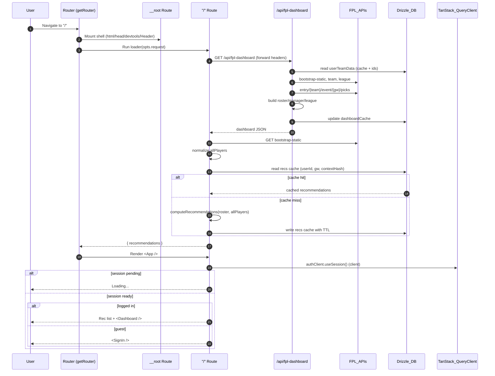

# Repository Guidelines

## Project Structure & Module Organization

- `src/` holds application code: `routes/` defines TanStack Start route loaders and components, `components/` contains reusable UI, `lib/` and `utils/` house shared logic, and `db/` exposes Drizzle ORM schema helpers.  
- `drizzle/` stores generated SQL migrations; regenerate via Drizzle CLI before committing schema changes.  
- `public/` serves static assets, while `dist/` is a build artifact and should not be edited manually.  
- Keep generated files such as `src/routeTree.gen.ts` under version control but avoid hand edits; re-run the router build when routes change.

## Build, Test, and Development Commands

- Install dependencies with `bun install` (lockfile is `bun.lock`).  
- `bun run dev` launches the Vite dev server on port 3000.  
- `bun run build` emits a production bundle into `dist/`; `bun run serve` previews that output.  
- Quality checks: `bun run lint`, `bun run format`, and `bun run check` (Biome aggregate).  
- Database workflows: `bun run db:generate` to emit SQL from the schema, `bun run db:migrate` to apply migrations locally, and `bun run db:studio` for the Drizzle Studio UI.

## Coding Style & Naming Conventions

- Biome enforces tab indentation and double quotes across TypeScript, JSX, and JSON—do not override editor defaults.  
- Prefer PascalCase for React components, camelCase for helpers, and kebab-case for filenames unless a framework requires otherwise.  
- Co-locate route-specific utilities next to the corresponding entry in `src/routes/` to keep TanStack Router loaders and components together.  
- Run `bun run format` before finishing each request; Biome also normalizes imports via its organize-imports assist. This helps keep code clean.

## Testing Guidelines

- Vitest with `@testing-library/react` powers unit and interaction tests; run them via `bun run test`.  
- Add specs alongside source as `*.test.ts` or `*.test.tsx` files so imports resolve with configured path aliases.  
- Stub network calls and database access by mocking Drizzle clients; prefer testing user-facing behavior through the router where feasible.  
- When adding significant features, gather coverage with `bunx vitest run --coverage` and include notable gaps in the PR description.

## Commit & Pull Request Guidelines

- Follow the repository’s Git history: concise, imperative commit subjects (e.g., `Fix lint warnings`) with optional context in the body.  
- Group related changes into a single commit that builds, formats, and passes tests.  
- Pull requests should summarize scope, list testing done (commands and environments), link relevant issues, and attach screenshots or recordings for UI-facing updates.  
- Mention required env variables (e.g., `DATABASE_URL` in `.env.local`) and migration steps whenever the change impacts deployment.

## Environment & Secrets

- `DATABASE_URL` powers Drizzle on the server (`src/db/index.ts`); sync it with your local Postgres or Neon instance.  
- `VITE_DATABASE_URL` is required by the Neon Vite plugin (`neon-vite-plugin.ts`) for browser/serverless queries during dev.  
- `ORIGIN`, `CLIENT_ORIGIN`, and `TRUSTED_ORIGINS` extend the Better Auth trusted origin list (`src/utils/auth.ts`).  
- Cron/webhook envs (`ALERT_*`) are documented in `email-cron-integration.md`; keep secrets out of the repo and surface required vars in PRs.

## Application Architecture Highlights

- Router setup lives in `src/router.tsx`; it injects a shared TanStack Query client via `src/integrations/tanstack-query/root-provider.tsx` and wires SSR prefetch with `setupRouterSsrQueryIntegration`.  
- `src/routes/__root.tsx` renders the shell (header, toast provider, devtools) and defines the `<html>` document.  
- The `/` route loader (`src/routes/index.tsx`) runs on the server, pulling session info, FPL dashboard data, bootstrap data, and recommendation cache before rendering.  
- Client components use React Query for API data (`Dashboard` uses `queryKey: ["fpl-dashboard"]`), so cache invalidation happens through React Query rather than manual fetches.

## Auth & Sessions

- Authentication flows through Better Auth with the Drizzle adapter (`src/utils/auth.ts`); `customSession` hydrates the session with FPL IDs from `user_team_data`.  
- `src/routes/api/auth/$.ts` proxies requests to Better Auth; React components call `authClient` (`src/utils/auth-client.ts`).  
- Sign-in/up forms live in `src/components/auth/`; they use React Query mutations plus shared form validation helpers in `src/utils/form-utils.ts`.

## API Surface & Caching

- `src/routes/api/fpl-dashboard.ts` orchestrates FPL fetches, computes league comparisons, attaches recommendations, and caches payloads in `userTeamData.dashboardCache` for five minutes.  
- `src/routes/api/fpl-roster.ts` returns the current squad and caches it separately (`rosterCache`, also five minutes).  
- `src/routes/api/user-settings.ts` and `update-user-settings.ts` fetch/update FPL IDs; updates clear both dashboard and roster caches to force fresh data.  
- `src/routes/index.tsx` loader caches recommendation payloads via `src/lib/fpl/cache.ts`, using a SHA-256 context hash keyed by user/gameweek and a six-hour TTL (`RECOMMENDATIONS_TTL_MS`).

## Recommendation Engine

- Core logic is in `src/lib/fpl/recommendations.ts`; it builds a candidate pool, evaluates players with weighted metrics, and returns top differentials.  
- Metric modules live under `src/lib/fpl/metrics/` (expected points delta, form delta/trend, fixture ease, value signal) with Vitest coverage alongside each file.  
- `src/lib/fpl/config.ts` controls weights (`metricWeights`), recommendation count, and TTL; bump `WEIGHTS_VERSION` to invalidate cache after major tuning.  
- Caching helpers (`computeContextHash`, `readRecommendationsCache`, `writeRecommendationsCache`) store JSON payloads in the `recommendations_cache` table (`src/lib/fpl/cache.ts`).  
- Tests for adapters/cache live in `src/lib/fpl/*.test.ts`; update them when adjusting scoring, selection heuristics, or cache shape.

## Dashboard & UI

- `src/components/dashboard/Dashboard.tsx` renders manager stats, league comparison, recommendations, and the pitch view (`SoccerField`).  
- `src/components/dashboard/Recommendations.tsx` formats the recommendation list and handles empty states.  
- `src/components/SettingsSheet.tsx` exposes FPL Team/League ID inputs, triggers cache invalidation through React Query, and provides logout.  
- Toasts are powered by `src/components/ui/toast`; keep messages short and user-focused.

## Database Footprint

- Auth tables (`user`, `session`, `account`, `verification`) are defined in both `auth-schema.ts` and `src/db/schema.ts`; keep them aligned with Better Auth expectations.  
- `user_team_data` stores FPL identifiers plus cached dashboard/roster blobs and timestamps.  
- `recommendations_cache` persists per-user differential payloads; Drizzle schema enforces a composite uniqueness constraint on `(user_id, league_id, gameweek, context_hash)`.  
- Run `bun run db:generate` after schema edits and commit the generated SQL in `drizzle/`; `db:migrate` applies migrations locally.

## Email Deadline Alerts

- `email-cron-integration.md` documents how the Val Town cron notifies this app. Build webhook handlers under `src/routes/api/webhooks.*` if you need to process alerts; verify signatures when `ALERT_WEBHOOK_SIGNING_SECRET` is set.

## Testing Notes

- Unit tests currently focus on the recommendation engine (`src/lib/fpl/**.test.ts`); extend coverage when altering recommendation weights or adapters.  
- Use `bun run test` for Vitest, `bun run lint`, and `bun run check` before finishing tasks; add targeted tests for new API handlers or utilities.

## Info Flow

