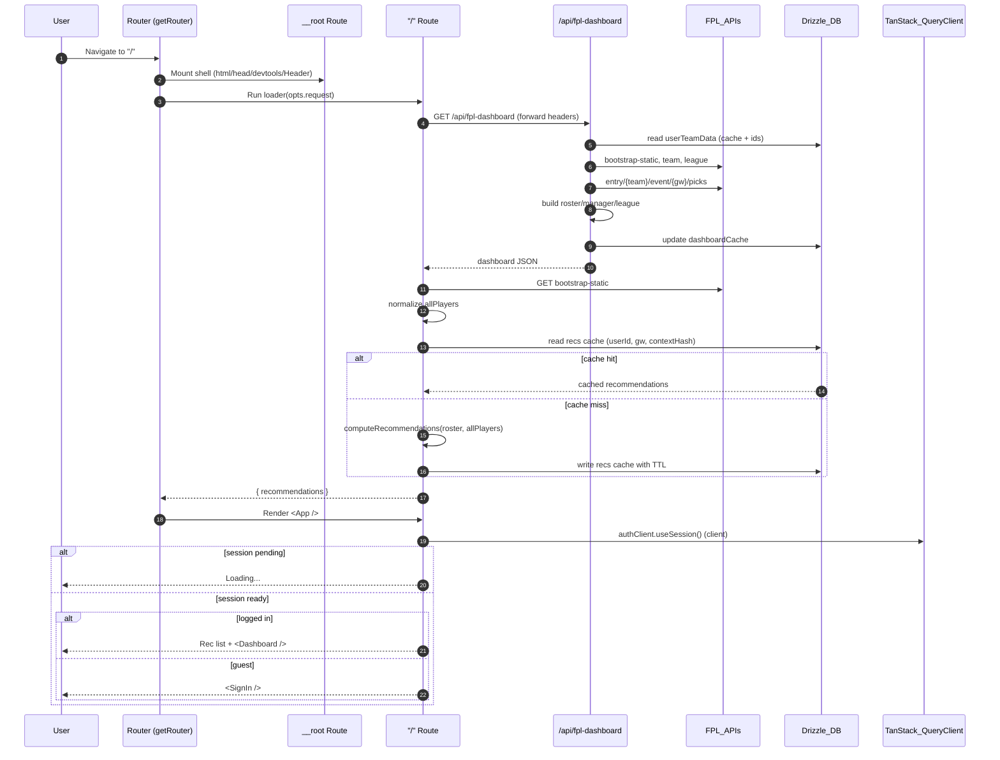

# Repository Guidelines

## Project Structure & Module Organization

- `src/` holds application code: `routes/` defines TanStack Start route loaders and components, `components/` contains reusable UI, `lib/` and `utils/` house shared logic, and `db/` exposes Drizzle ORM schema helpers.  
- `drizzle/` stores generated SQL migrations; regenerate via Drizzle CLI before committing schema changes.  
- `public/` serves static assets, while `dist/` is a build artifact and should not be edited manually.  
- Keep generated files such as `src/routeTree.gen.ts` under version control but avoid hand edits; re-run the router build when routes change.

## Build, Test, and Development Commands

- Install dependencies with `bun install` (lockfile is `bun.lock`).  
- `bun run dev` launches the Vite dev server on port 3000.  
- `bun run build` emits a production bundle into `dist/`; `bun run serve` previews that output.  
- Quality checks: `bun run lint`, `bun run format`, and `bun run check` (Biome aggregate).  
- Database workflows: `bun run db:generate` to emit SQL from the schema, `bun run db:migrate` to apply migrations locally, and `bun run db:studio` for the Drizzle Studio UI.

## Coding Style & Naming Conventions

- Biome enforces tab indentation and double quotes across TypeScript, JSX, and JSON—do not override editor defaults.  
- Prefer PascalCase for React components, camelCase for helpers, and kebab-case for filenames unless a framework requires otherwise.  
- Co-locate route-specific utilities next to the corresponding entry in `src/routes/` to keep TanStack Router loaders and components together.  
- Run `bun run format` before finishing each request; Biome also normalizes imports via its organize-imports assist. This helps keep code clean.

## Testing Guidelines

- Vitest with `@testing-library/react` powers unit and interaction tests; run them via `bun run test`.  
- Add specs alongside source as `*.test.ts` or `*.test.tsx` files so imports resolve with configured path aliases.  
- Stub network calls and database access by mocking Drizzle clients; prefer testing user-facing behavior through the router where feasible.  
- When adding significant features, gather coverage with `bunx vitest run --coverage` and include notable gaps in the PR description.

## Commit & Pull Request Guidelines

- Follow the repository’s Git history: concise, imperative commit subjects (e.g., `Fix lint warnings`) with optional context in the body.  
- Group related changes into a single commit that builds, formats, and passes tests.  
- Pull requests should summarize scope, list testing done (commands and environments), link relevant issues, and attach screenshots or recordings for UI-facing updates.  
- Mention required env variables (e.g., `DATABASE_URL` in `.env.local`) and migration steps whenever the change impacts deployment.

## Info Flow

